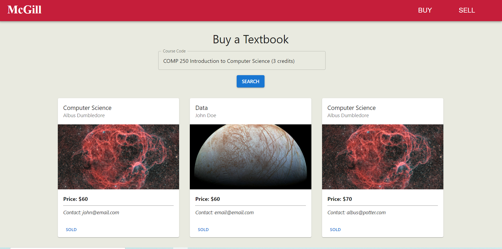
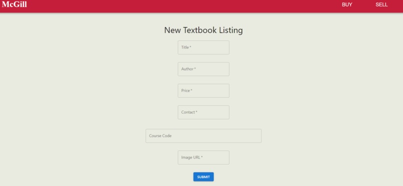

# McGill Textbook Exchange

Built for hack McWiCS 2022 - a hub for students who want to purchase textbooks at a discount according to the course code they're enrolled in at McGill.

  

## Technologies Used

**React, Material UI** for front-end
**Node.js and Firebase** for back-end

  

## Access project

To access this project without downloading lots of files / dependencies, head on over to this link: https://elephant-f5f16.web.app/

